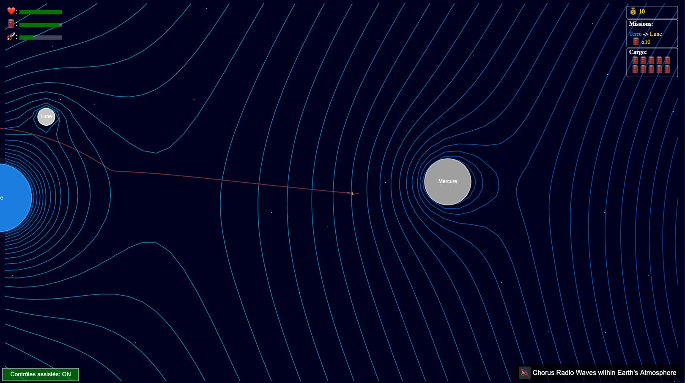

# Pocket Cosmos : Simulation de Fusée 🚀

Une simulation interactive et physique d'une fusée utilisant Matter.js, avec des missions, de la gestion de cargo et une IA optionnelle. 🌌

## 🚀 Présentation

Prenez les commandes ! Ce projet vous permet de piloter une fusée dans un mini-système solaire, d'accomplir des missions, de gérer votre cargaison, et de maîtriser les subtilités de la gravité et des atterrissages (plus ou moins) réussis. 🌍🌕🛰️

- [Lancer la Simulation](https://habib256.github.io/pocketcosmos/index.html)
  _(Cliquez pour essayer !)_ ✨

### Captures d'écran 📸


*Écran de démarrage avec sélection du monde à gauche et bouton "Prêt !" à droite*


*La fusée près de la lune en orbite avec affichage des vecteurs de la fusée*


*Suivi de la trajectoire*


*Tracée des équipotentielles*

## ✨ Fonctionnalités Principales

### Simulation & Physique
*   **Physique Réaliste (Matter.js):** Simulation basée sur Matter.js 0.19.0 avec gestion de la gravité via le plugin matter-attractors.
*   **Mécaniques d'Atterrissage/Crash 😬💥:** Maîtrisez les atterrissages en douceur ou subissez les conséquences d'un crash.
*   **Champ de Gravité et Lignes Équipotentielles 🌀:** Visualisez le champ de gravité sous forme de flèches ou de lignes équipotentielles (isopotentielles).

### Gameplay
*   **Système de Missions 🏆:** Acceptez et accomplissez des missions de transport entre corps célestes.
*   **Gestion de Cargo 📦:** Collectez, transportez et livrez différentes cargaisons (carburant, outils, etc.).
*   **Système de Crédits 💰:** Gagnez des crédits en réussissant des missions.
*   **6 Mondes Disponibles 🌍:** Système solaire, Kerbol, Outer Wilds, Tatoo, Endor, et un monde alien.
*   **Stations Spatiales 🛰️:** Amarrez-vous aux stations pour vous ravitailler.

### Contrôles & Interface
*   **Pilotage Intuitif 👍:** Contrôlez précisément votre fusée avec plusieurs propulseurs.
*   **Caméra Dynamique 🎥:** Suivi de la fusée et zoom ajustable.
*   **Interface Utilisateur Complète 📊:** Suivez vitesse, altitude, fuel, santé, mission active, cargo, crédits.
*   **Trajectoire Visible 📈:** Activez la trace pour visualiser votre parcours.
*   **Aide au Pilotage 🤓:** Contrôles assistés pour une meilleure stabilisation.

### Visuels & Audio
*   **Effets Visuels ✨:** Particules pour les propulseurs, débris de crash, étoiles scintillantes.
*   **Ombres/Pénombres Planétaires:** Ombrage jour→nuit orienté par l'étoile centrale, atmosphères ombrées.
*   **Anneaux Planétaires:** Rendus en deux passes (back/front) pour un effet réaliste.
*   **Ambiance Sonore Riche 🔊:** Musique d'ambiance spatiale variée, sons pour les propulseurs, collisions et crashs.

### Intelligence Artificielle
*   **IA Optionnelle (TensorFlow.js) 🤖:** Agent Deep Q-Network pour piloter automatiquement la fusée.
*   **Interface d'Entraînement Complète:** Application web dédiée (`training-interface.html`) avec graphiques temps réel, métriques et visualisation.

### Architecture
*   **Architecture Modulaire (MVC + EventBus) 🏗️:** Code structuré et découplé facilitant la maintenance et l'évolution.
*   **Génération Procédurale:** Support pour le chargement de mondes préconfigurés ou générés aléatoirement.

## 🎮 Contrôles

- **↑ ou W** : Propulsion avant (principale)
- **↓ ou S** : Propulsion arrière (rétro)
- **← (Flèche Gauche)** : Rotation vers la **droite**
- **→ (Flèche Droite)** : Rotation vers la **gauche**
- **A** : Rotation vers la **gauche** (propulseur latéral)
- **D** : Rotation vers la **droite** (propulseur latéral)
- **Barre Espace** : Propulsion avant (Boost)
- **R** : Réinitialiser la fusée 🔄
- **C** : Centrer la caméra sur la fusée 🎯
- **+ / -** (ou Molette Souris) : Zoom avant / arrière 🔍
- **T** : Afficher/masquer la trace de trajectoire
- **V** : Afficher/masquer les vecteurs de force (pour debug)
- **G** : Afficher/masquer le champ de gravité (flèches puis lignes équipotentielles)
- **I** : Activer/désactiver le contrôle par l'IA 🤖
- **P** ou **Echap** : Pause / Reprendre la simulation
- **M** : Diminuer la puissance globale des propulseurs
- **N** : Augmenter la puissance globale des propulseurs

## 🔧 Technologies

- **Matter.js** (`0.19.0`) + **Matter-Attractors** (`0.1.6`) - Moteur physique et gravité
- **TensorFlow.js** (`4.13.0`) - Intelligence artificielle (Deep Q-Network)
- **HTML5 Canvas** - Rendu graphique
- **JavaScript** (ES6+) - Logique applicative

## 🏗️ Architecture

Le projet suit une architecture **MVC étendue avec EventBus** pour une communication découplée :

```
├── models/         # État des données (RocketModel, UniverseModel, etc.)
├── views/          # Rendu visuel (RocketView, UniverseView, UIView, etc.)
├── controllers/    # Logique métier (GameController, PhysicsController, etc.)
├── assets/worlds/  # Presets de mondes JSON
├── constants.js    # Constantes globales
└── EventTypes.js   # Définitions des événements
```

**Fichiers clés :**
- `GameController.js` - Chef d'orchestre, boucle de jeu principale
- `RocketModel.js` - État complet de la fusée
- `RenderingController.js` - Coordination du rendu

> 📖 **Pour les développeurs :** Consultez `CLAUDE.md` pour la documentation technique complète de l'architecture.

**Nouveauté pédagogique :**
- L'affichage du champ de gravité (touche G) permet d'explorer visuellement l'influence gravitationnelle de chaque corps céleste, et de comprendre la notion de potentiel gravitationnel (lignes équipotentielles) dans un système multi-corps. Outil idéal pour l'enseignement ou l'expérimentation !

## 🚀 Installation

### Pour Jouer
1.  Clonez ce dépôt : `git clone https://github.com/habib256/pocketcosmos.git` 📥
2.  Naviguez dans le dossier `pocketcosmos`.
3.  Ouvrez le fichier `index.html` dans votre navigateur web moderne. 🎉

### Pour Développer
1. Clonez le dépôt
2. Lancez un serveur local : `python -m http.server 8000`
3. Ouvrez `http://localhost:8000/index.html` dans votre navigateur
4. Pour l'interface d'entraînement IA : `http://localhost:8000/training-interface.html`

**Remarques :**
- Tous les scripts sont chargés via `<script>` dans les fichiers HTML (pas d'import ES6, pas de build step).
- Le plugin `matter-attractors` peut afficher un avertissement de version; il est compatible avec `matter-js@0.19.0`.
- Pas de npm/package.json : toutes les dépendances sont chargées via CDN.

## 🤖 Intelligence Artificielle

Le projet inclut un système d'IA basé sur **Deep Q-Network (DQN)** avec TensorFlow.js.

### Interface d'Entraînement (`training-interface.html`)
L'interface web complète permet de :
- Configurer les paramètres d'entraînement (épisodes, learning rate, etc.)
- Visualiser les performances en temps réel (graphiques)
- Suivre les métriques (récompense, epsilon, etc.)
- Observer la trajectoire de l'agent

### Composants IA
- **`RocketAI.js`** - Agent DQN qui prend les décisions de pilotage
- **`TrainingOrchestrator.js`** - Gestion des épisodes et récompenses
- **`HeadlessRocketEnvironment.js`** - Simulation rapide sans rendu graphique
- **`TrainingVisualizer.js`** - Visualisation temps réel des métriques

### Utilisation
1. **Interface Web** (recommandé) : Ouvrez `training-interface.html`
2. **Console** : Utilisez les scripts dans `train.js`
3. **En jeu** : Appuyez sur `I` pour activer/désactiver le contrôle IA

## 📝 Personnalisation

### Constantes (`constants.js`)
Envie d'expérimenter ? 🧪 Le fichier `constants.js` est votre terrain de jeu ! Modifiez :

- La gravité (`PHYSICS.G`)
- La puissance et l'efficacité des propulseurs (`ROCKET.THRUSTER_POWER`, `ROCKET.FUEL_EFFICIENCY`)
- Les caractéristiques de la fusée (masse, carburant max, résistance `ROCKET.MAX_HEALTH`)
- Les paramètres d'orbite des corps célestes (`UNIVERSE`)
- Les seuils de difficulté (atterrissage, crash `PHYSICS.LANDING_MAX_SPEED`, `PHYSICS.IMPACT_DAMAGE_FACTOR`)
- Les paramètres d'entraînement IA (`AI`)

### Presets de Mondes 🌍
Sélectionnez le monde au démarrage (Monde 1 par défaut). Les fichiers sont dans `assets/worlds/` :

| Fichier | Description |
|---------|-------------|
| `1_solar.json` | Système solaire simplifié |
| `2_kerbol.json` | Système Kerbol (inspiré de KSP) |
| `3_outerwilds.json` | Système Outer Wilds |
| `4_Tatoo.json` | Système Tatoo (Star Wars) |
| `5_Endor.json` | Système Endor (Star Wars) |
| `6_alien.json` | Système alien |

### Structure des Presets JSON
Chaque preset peut définir :
- `bodies[]` - Corps célestes avec :
  - `hasRings` - Anneaux planétaires
  - `atmosphere { exists, height, color }` - Atmosphère
- `rocket.spawn` - Position de départ :
  - Par corps céleste : `{ hostName, angle }`
  - Par coordonnées : `{ position, velocity, angle }`
- `stations[]` - Stations spatiales ancrées aux corps
- `asteroidBelts[]` - Ceintures d'astéroïdes procédurales
- `starsConfig` - Configuration des étoiles d'arrière-plan
- `missions[]` - Missions disponibles
- `narratives` - Éléments narratifs

## 📈 Perspectives Futures

- **Missions** : Plus de missions variées (exploration, réparation, sauvetage)
- **Univers** : Davantage de corps célestes et de systèmes solaires
- **IA** : Architectures avancées (Actor-Critic, LSTM) et environnements plus complexes
- **Performance** : Optimisations (quad-tree pour gravité)
- **Multijoueur** : Support multijoueur potentiel
- **Éditeur de Mondes** : Interface pour créer ses propres systèmes

## 🤝 Contribution

Les contributions sont les bienvenues ! Pour contribuer :
1. Consultez `CLAUDE.md` pour comprendre l'architecture
2. Consultez `TODO.md` pour les bugs connus et améliorations planifiées
3. Ouvrez une issue ou une pull request

## 📜 Licence

Ce projet est sous licence **GPL-3.0**. Voir le fichier `LICENSE` pour plus de détails.
