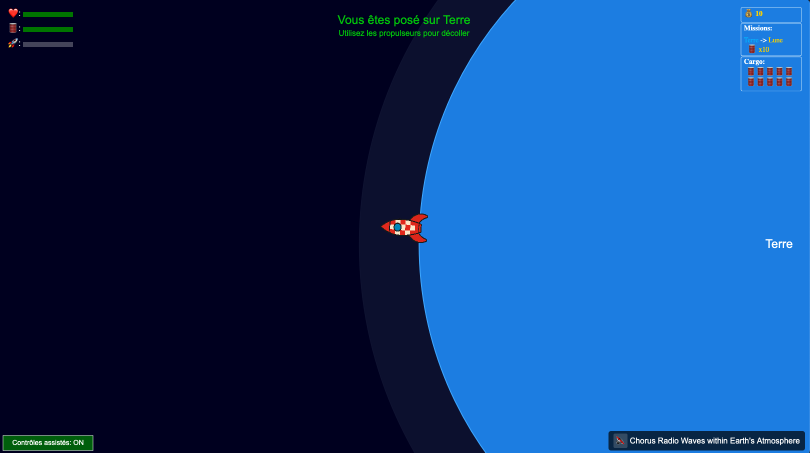
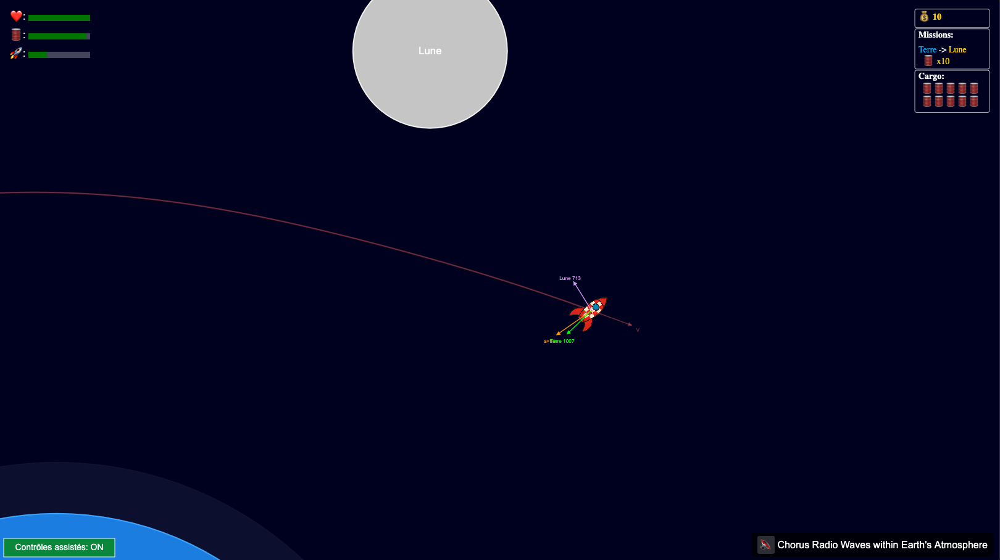
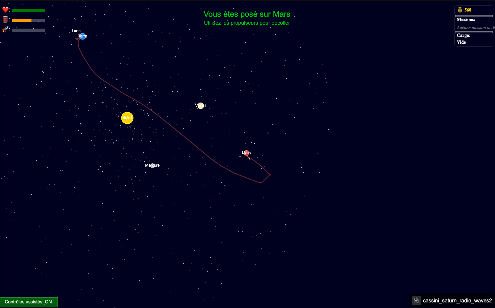

# Pocket Cosmos : Simulation de Fusée 🚀 - Version 1.0

Une simulation interactive et physique d'une fusée utilisant Matter.js, avec des missions, de la gestion de cargo et une IA optionnelle. 🌌

## 🚀 Présentation

Prenez les commandes ! Ce projet vous permet de piloter une fusée dans un mini-système solaire, d'accomplir des missions, de gérer votre cargaison, et de maîtriser les subtilités de la gravité et des atterrissages (plus ou moins) réussis. 🌍🌕🛰️

- [Lancer la Simulation](https://habib256.github.io/pocketcosmos/index.html)
  _(Cliquez pour essayer !)_ ✨

### Captures d'écran 📸

*Écran de démarrage de la simulation*

*Visualisation des forces en action* 🧐

*La fusée près de la lune en orbite*

*Suivi de la trajectoire* ዱካ

## ✨ Fonctionnalités Principales

*   **Physique Réaliste (Matter.js) 😂:** Simulation basée sur Matter.js avec gestion de la gravité via le plugin Attractors.
*   **Système de Missions 🏆:** Acceptez et accomplissez des missions de transport entre corps célestes.
*   **Gestion de Cargo 📦:** Collectez, transportez et livrez différentes cargaisons (carburant, outils, etc.).
*   **Système de Crédits 💰:** Gagnez des crédits en réussissant des missions.
*   **Pilotage Intuitif 👍:** Contrôlez précisément votre fusée avec plusieurs propulseurs.
*   **Exploration Spatiale 🪐:** Naviguez autour d'une planète et de sa lune en orbite.
*   **Mécaniques d'Atterrissage/Crash 😬💥:** Maîtrisez les atterrissages en douceur ou subissez les conséquences d'un crash.
*   **IA Optionnelle (TensorFlow.js) 🤖:** Activez un agent IA pour observer son comportement (basé sur TensorFlow.js).
*   **Effets Visuels ✨:** Particules pour les propulseurs, débris de crash, étoiles scintillantes.
*   **Interface Utilisateur Complète 📊:** Suivez vitesse, altitude, fuel, santé, mission active, cargo, crédits.
*   **Trajectoire Visible 📈:** Activez la trace pour visualiser votre parcours.
*   **Caméra Dynamique 🎥:** Suivi de la fusée et zoom ajustable.
*   **Santé et Carburant ❤️‍🩹⛽:** Gérez vos ressources vitales.
*   **Aide au Pilotage 🤓:** Activez les contrôles assistés pour une meilleure stabilisation.
*   **Ambiance Sonore Riche 🔊:** Musique d'ambiance spatiale variée, sons pour les propulseurs, collisions et crashs.
*   **(Debug) Visualisation des Forces 🔬:** Activez l'affichage des vecteurs pour comprendre la physique.
*   **Architecture Modulaire (EventBus) 🏗️:** Code structuré et découplé facilitant la maintenance et l'évolution.

## 🎮 Contrôles

- **↑ ou W** : Propulsion avant (principale)
- **↓ ou S** : Propulsion arrière (rétro)
- **← ou A** : Rotation gauche (propulseur latéral)
- **→ ou D** : Rotation droite (propulseur latéral)
- **R** : Réinitialiser la fusée 🔄
- **C** : Centrer la caméra sur la fusée 🎯
- **+ / -** (ou Molette Souris) : Zoom avant / arrière 🔍
- **T** : Afficher/masquer la trace de trajectoire
- **V** : Afficher/masquer les vecteurs de force (pour debug)
- **I** : Activer/désactiver le contrôle par l'IA 🤖

## 🔧 Technologies

- **Matter.js** (`0.19.0`) + **Matter-Attractors** (`0.1.6`)
- **TensorFlow.js** (`4.13.0`)
- **HTML5 Canvas**
- **JavaScript** (ES6+)

_(Le code est structuré de manière modulaire (inspiration MVC étendue + EventBus) pour faciliter la compréhension et les modifications 😉)._

## 🚀 Installation

1.  Clonez ce dépôt : `git clone https://github.com/habib256/pocketcosmos.git` 📥
2.  Naviguez dans le dossier `pocketcosmos`.
3.  Ouvrez le fichier `index.html` dans votre navigateur web moderne. 🎉

## 📝 Personnalisation

Envie d'expérimenter ? 🧪 Le fichier `constants.js` est votre terrain de jeu ! Modifiez :

- La gravité (`PHYSICS.G`)
- La puissance et l'efficacité des propulseurs (`ROCKET.THRUSTER_POWER`, `ROCKET.FUEL_EFFICIENCY`)
- Les caractéristiques de la fusée (masse, carburant max, résistance `ROCKET.MAX_HEALTH`)
- Les paramètres d'orbite des corps célestes (`UNIVERSE`)
- Les seuils de difficulté (atterrissage, crash `PHYSICS.LANDING_MAX_SPEED`, `PHYSICS.IMPACT_DAMAGE_FACTOR`)
- ...et bien plus ! 🛠️

## 📈 Perspectives Futures

- Plus de missions variées (exploration, réparation ?)
- Davantage de corps célestes et de systèmes solaires ?
- Amélioration de l'IA et options d'entraînement ?
- Optimisations des performances.
- Raffinements visuels et sonores.

## 📜 Licence

Ce projet est sous licence GPL3. 👍 